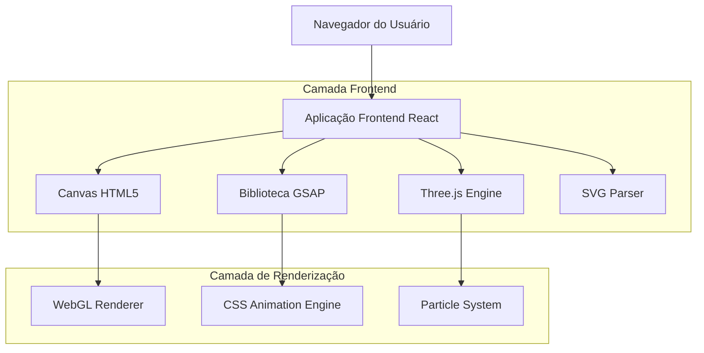
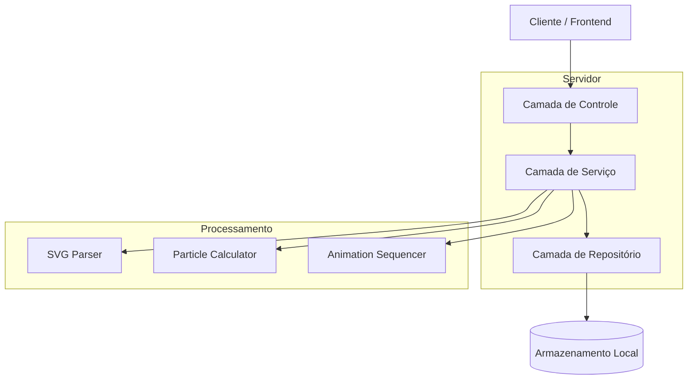
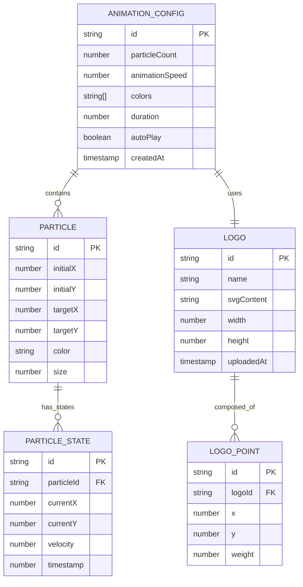

# Documentação de Arquitetura Técnica - Animação de Partículas para Logo

## 1. Design da Arquitetura



## 2. Descrição das Tecnologias

- **Frontend**: React@18 + TypeScript + Vite
- **Animação**: GSAP@3.12 + Three.js@0.158
- **Estilização**: TailwindCSS@3 + CSS Modules
- **Gráficos**: Canvas API + WebGL + SVG
- **Build**: Vite + ESBuild

## 3. Definições de Rotas

| Rota | Propósito |
|------|----------|
| / | Página principal com animação de partículas |
| /demo | Galeria de demonstrações e variações |
| /config | Painel de configuração para administradores |
| /preview | Preview em tempo real das configurações |

## 4. Definições da API

### 4.1 API Principal

**Configuração da Animação**
```
POST /api/animation/config
```

Request:
| Nome do Parâmetro | Tipo | Obrigatório | Descrição |
|-------------------|------|-------------|----------|
| particleCount | number | true | Número de partículas (100-5000) |
| animationSpeed | number | true | Velocidade da animação (0.1-2.0) |
| colors | string[] | true | Array de cores em formato hex |
| logoSvg | string | true | Conteúdo SVG da logo em base64 |

Response:
| Nome do Parâmetro | Tipo | Descrição |
|-------------------|------|----------|
| success | boolean | Status da operação |
| configId | string | ID da configuração salva |

Exemplo:
```json
{
  "particleCount": 2000,
  "animationSpeed": 1.2,
  "colors": ["#00FFFF", "#1A0B3D", "#FFFFFF"],
  "logoSvg": "data:image/svg+xml;base64,PHN2Zy4uLg=="
}
```

**Upload de Logo SVG**
```
POST /api/logo/upload
```

Request:
| Nome do Parâmetro | Tipo | Obrigatório | Descrição |
|-------------------|------|-------------|----------|
| file | File | true | Arquivo SVG da logo |
| name | string | true | Nome identificador da logo |

Response:
| Nome do Parâmetro | Tipo | Descrição |
|-------------------|------|----------|
| success | boolean | Status do upload |
| logoPoints | Point[] | Array de pontos extraídos do SVG |
| logoId | string | ID único da logo |

## 5. Diagrama da Arquitetura do Servidor



## 6. Modelo de Dados

### 6.1 Definição do Modelo de Dados



### 6.2 Linguagem de Definição de Dados

**Configuração da Animação (animation_configs)**
```typescript
// Definição de tipos TypeScript
interface AnimationConfig {
  id: string;
  particleCount: number;
  animationSpeed: number;
  colors: string[];
  duration: number;
  autoPlay: boolean;
  createdAt: Date;
}

interface Particle {
  id: string;
  position: { x: number; y: number };
  target: { x: number; y: number };
  velocity: { x: number; y: number };
  color: string;
  size: number;
  opacity: number;
}

interface LogoPoint {
  x: number;
  y: number;
  weight: number;
}

// Configuração inicial
const defaultConfig: AnimationConfig = {
  id: 'default',
  particleCount: 2000,
  animationSpeed: 1.0,
  colors: ['#00FFFF', '#1A0B3D', '#FFFFFF'],
  duration: 8000,
  autoPlay: true,
  createdAt: new Date()
};
```

**Sistema de Partículas (ParticleSystem)**
```typescript
class ParticleSystem {
  private particles: Particle[] = [];
  private canvas: HTMLCanvasElement;
  private ctx: CanvasRenderingContext2D;
  private animationId: number;
  
  constructor(canvas: HTMLCanvasElement, config: AnimationConfig) {
    this.canvas = canvas;
    this.ctx = canvas.getContext('2d')!;
    this.initializeParticles(config);
  }
  
  private initializeParticles(config: AnimationConfig): void {
    // Criar partículas com posições aleatórias
    for (let i = 0; i < config.particleCount; i++) {
      this.particles.push({
        id: `particle_${i}`,
        position: {
          x: Math.random() * this.canvas.width,
          y: Math.random() * this.canvas.height
        },
        target: { x: 0, y: 0 }, // Será definido pela logo
        velocity: { x: 0, y: 0 },
        color: config.colors[Math.floor(Math.random() * config.colors.length)],
        size: Math.random() * 3 + 1,
        opacity: Math.random() * 0.8 + 0.2
      });
    }
  }
  
  public setLogoTargets(logoPoints: LogoPoint[]): void {
    // Distribuir partículas pelos pontos da logo
    this.particles.forEach((particle, index) => {
      const targetPoint = logoPoints[index % logoPoints.length];
      particle.target = { x: targetPoint.x, y: targetPoint.y };
    });
  }
  
  public animate(): void {
    // Loop de animação principal
    this.animationId = requestAnimationFrame(() => this.animate());
    this.updateParticles();
    this.render();
  }
}
```

**Parser de SVG para Pontos**
```typescript
class SVGToPointsParser {
  public static parseLogoSVG(svgContent: string): LogoPoint[] {
    const parser = new DOMParser();
    const svgDoc = parser.parseFromString(svgContent, 'image/svg+xml');
    const paths = svgDoc.querySelectorAll('path');
    const points: LogoPoint[] = [];
    
    paths.forEach(path => {
      const pathData = path.getAttribute('d');
      if (pathData) {
        const pathPoints = this.extractPointsFromPath(pathData);
        points.push(...pathPoints);
      }
    });
    
    return this.optimizePoints(points);
  }
  
  private static extractPointsFromPath(pathData: string): LogoPoint[] {
    // Implementação para extrair pontos de comandos SVG path
    // Converte comandos M, L, C, Q em coordenadas x,y
    return [];
  }
  
  private static optimizePoints(points: LogoPoint[]): LogoPoint[] {
    // Otimizar densidade de pontos para melhor performance
    return points.filter((point, index) => index % 2 === 0);
  }
}
```