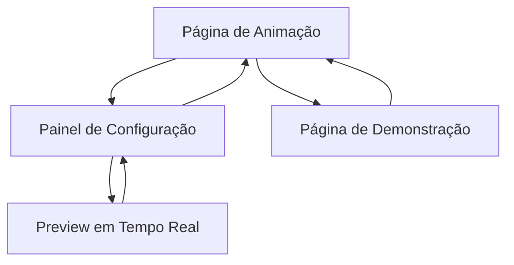

# Documentação de Requisitos do Produto - Animação de Partículas para Logo

## 1. Visão Geral do Produto

Sistema de animação web interativa que transforma partículas flutuantes em uma logo corporativa através de efeitos visuais avançados. A animação cria uma experiência imersiva onde milhares de partículas se movem organicamente pelo espaço, conectadas por linhas de dados, até convergirem gradualmente para formar a identidade visual da marca com efeitos de brilho e pulsação.

O produto visa criar um impacto visual memorável para landing pages, apresentações corporativas e experiências de marca digitais.

## 2. Funcionalidades Principais

### 2.1 Papéis de Usuário

| Papel | Método de Acesso | Permissões Principais |
|-------|------------------|----------------------|
| Visitante | Acesso direto via navegador | Visualizar animação, interagir com controles básicos |
| Administrador | Painel de configuração | Personalizar parâmetros, alterar logo, ajustar timing |

### 2.2 Módulos Funcionais

Nossa solução de animação consiste nas seguintes páginas principais:

1. **Página de Animação**: canvas principal, controles de reprodução, indicador de progresso.
2. **Painel de Configuração**: editor de parâmetros, upload de logo, preview em tempo real.
3. **Página de Demonstração**: galeria de exemplos, diferentes variações de animação.

### 2.3 Detalhes das Páginas

| Nome da Página | Nome do Módulo | Descrição da Funcionalidade |
|----------------|----------------|-----------------------------|
| Página de Animação | Canvas Principal | Renderizar partículas em movimento, controlar física das partículas, gerenciar conexões entre pontos |
| Página de Animação | Sistema de Formação | Calcular trajetórias das partículas, animar transição para formato da logo, sincronizar movimento coletivo |
| Página de Animação | Efeitos Visuais | Aplicar brilho neon, transições de cor suaves, pulsação final da logo |
| Painel de Configuração | Editor de Parâmetros | Ajustar velocidade, densidade de partículas, cores, intensidade de brilho |
| Painel de Configuração | Gerenciador de Logo | Upload de SVG, validação de formato, conversão para pontos de destino |
| Página de Demonstração | Galeria de Exemplos | Exibir variações pré-configuradas, permitir seleção de templates |

## 3. Processo Principal

**Fluxo do Usuário Visitante:**
1. Usuário acessa a página de animação
2. Animação inicia automaticamente com partículas flutuantes
3. Partículas gradualmente se organizam formando a logo
4. Efeitos de brilho e pulsação finalizam a sequência
5. Usuário pode reiniciar ou ajustar configurações básicas

**Fluxo do Administrador:**
1. Acessa painel de configuração
2. Personaliza parâmetros da animação
3. Faz upload de nova logo em formato SVG
4. Visualiza preview em tempo real
5. Salva configurações e publica alterações

## 4. Design da Interface do Usuário

### 4.1 Estilo de Design

- **Cores Primárias**: Azul neon (#00FFFF), Roxo escuro (#1A0B3D)
- **Cores Secundárias**: Branco puro (#FFFFFF), Cinza escuro (#2D2D2D)
- **Estilo de Botões**: Bordas arredondadas com efeito glow, transparência sutil
- **Fonte**: 'Inter' ou 'Roboto' - tamanhos 14px (corpo), 18px (títulos), 24px (cabeçalhos)
- **Layout**: Design minimalista com foco no canvas, controles discretos nas bordas
- **Ícones**: Estilo linear com efeitos de brilho, compatíveis com tema futurístico

### 4.2 Visão Geral do Design das Páginas

| Nome da Página | Nome do Módulo | Elementos da UI |
|----------------|----------------|----------------|
| Página de Animação | Canvas Principal | Fundo escuro gradiente, canvas fullscreen, partículas com brilho azul/roxo, linhas conectoras semi-transparentes |
| Página de Animação | Controles | Botões flutuantes com ícones play/pause/restart, slider de velocidade, indicador de progresso circular |
| Painel de Configuração | Editor de Parâmetros | Sliders com valores numéricos, seletores de cor com preview, toggles para efeitos especiais |
| Painel de Configuração | Upload de Logo | Área de drag-and-drop estilizada, preview da logo convertida em pontos, validação visual |

### 4.3 Responsividade

O produto é desenvolvido com abordagem mobile-first, garantindo adaptação fluida para tablets e desktops. A animação ajusta automaticamente a densidade de partículas baseada na performance do dispositivo, com otimizações específicas para interação touch em dispositivos móveis.